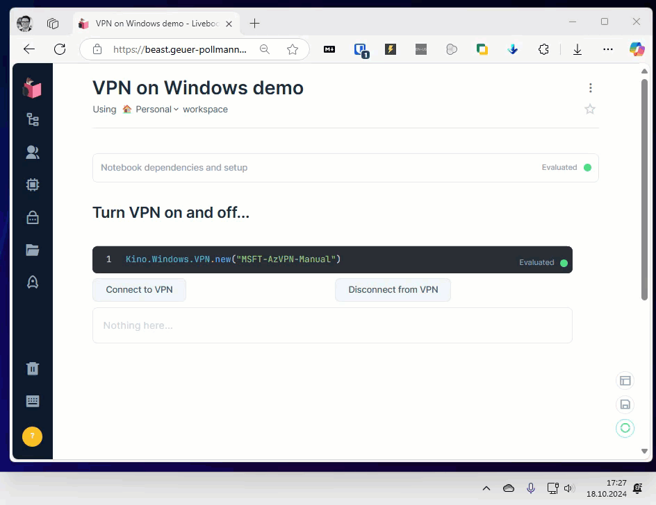

# `ex_win_vpn`

A simple utility that shells out to `rasdial.exe` to establish/tear down VPN connections.

Just include `{:ex_win_vpn, github: "chgeuer/ex_win_vpn"}` in your mix.exs, and call `Kino.Windows.VPN.new(your_vpn_name)` in your Livebook. 

Or call `Windows.VPN.connect(vpn_name)` in your code.

## Demo

